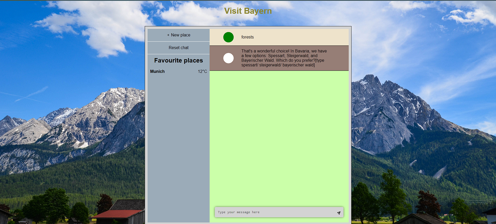

# Bayern Travel Guide Agent

Welcome to the Bayern Travel Guide Agent, a web application that suggests the best places to visit in Bayern, Germany. This application is built with React for the frontend and Node.js for the backend. It aims to provide users with a personalized travel experience by recommending top destinations in the beautiful region of Bayern.



## Table of Contents

- [Project Overview](#project-overview)
- [Features](#features)
- [Tech Stack](#tech-stack)
- [Installation](#installation)
- [Usage](#usage)
- [Contributing](#contributing)
- [License](#license)

## Project Overview

The Bayern Travel Guide Agent is designed to help tourists and travelers explore the rich cultural and natural attractions of Bayern. The application provides curated suggestions for places to visit, including historical landmarks, natural parks, and cultural experiences.

## Features

- **Personalized Recommendations**: Get travel suggestions based on your preferences.
- **Detailed Information**: Each recommendation comes with a description and ability to check the weather at the location
- **Responsive Design**: Optimized for both desktop and mobile devices.

## Tech Stack

- **Frontend**: React, CSS, HTML
- **Backend**: Node.js, Express
- **Dependencies**: 
  - Frontend: react, react-dom, react-scripts, @testing-library/react, @testing-library/jest-dom, @testing-library/user-event, web-vitals
  - Backend: express, cors, readline, socket.io, socket.io-client, body-parser, morgan, openai, kill-port
- **Development Tools**: nodemon

## Installation

To run this project locally, follow these steps:

### Prerequisites

- Node.js and npm installed on your machine

### Clone the Repository

```bash
git clone https://github.com/teewhymagg/travel_bot.git
cd travel_bot
cd Backend 
npm install
npm start
cd Frontend
npm install
npm start
```
